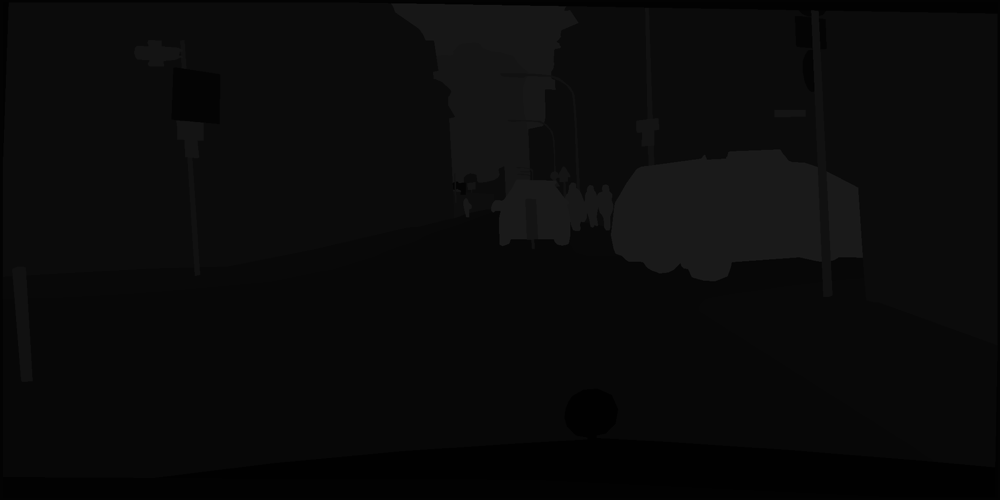
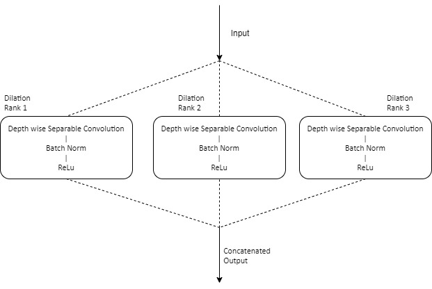
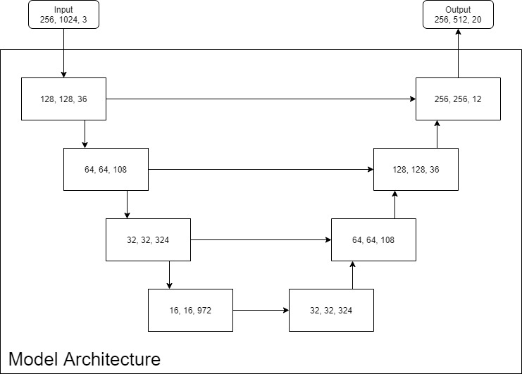
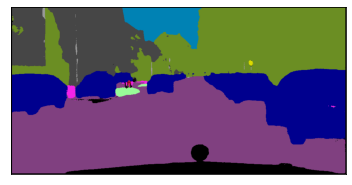
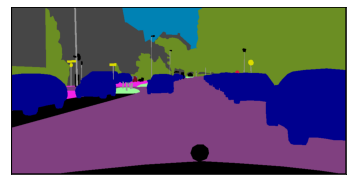

# semantic-segmentation

## Overview:

This repository contains the implementation of semantic segmentation on the CityScapes dataset using U-NET Convolution Neural Networks with dilated and epth-wise separable convolutions.

## Dataset:

Cityscapes dataset consists of a diverse set of stereo videos from 50 different cities. The dataset consists of 5000 labeled frames. This dataset is intended for assessing the performance of Computer vision algorithms for image segmentations.

The dataset in total consists of 34 classes out of which 15 classes are combined as a single class, named 'misc'. Thus, the image segmentation is done using 20 classes. 

Examples of the dataset:

Input Image                |  Corresponding Labels
:-------------------------:|:-------------------------:
   |  

## Model Architecture

For this project, an innovative sub-model that uses depth-wise separable convolutions with different dilation rates is designed. 

Dilated convolutions help to increase the receptive fields for the filters at the same computation cost. In this project, features extracted using different dilation rates (1 to 3) are concatenated to augment the informativeness of the input.
Depth-wise separable convolutions are preferred over the normal convolutions as they perform 100 times lesser multiplications, reducing the FLOPS significantly without compromising the accuracy. 

Thus, this unique sub-model uses parallel convolutional layers with different dilated rate parameters to extract information at multiple scales in lesser computational time.

 

An encoder-decoder network with U-Net type architecture was preferred with skip connections. With these residual connections, the model can combine global information and the context to provide better performance for segmentation. At each step, the sub-model is performed. 

 

## Results:

Using this model architecture and training from scratch,  a mean IOU of 0.7815 was acheived.

Example of the output predicted by the model:

Predicted Image                |  Corresponding Label
:-------------------------:|:-------------------------:
   |  

